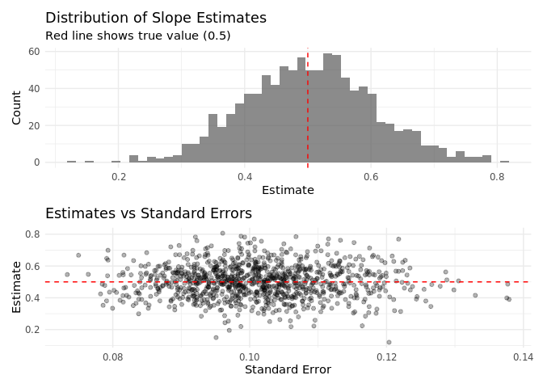

<span class="dropcap dropcap--ornate dropcap--serious" data-first-letter="R" aria-hidden="true">R</span>eproducibility is crucial for simulation studies, not just for scientific transparency but also for debugging. When something goes wrong in your simulation, you need to be able to reproduce the exact same results to figure out what happened.

## The Problem

Random number generation is, by definition, random. Each time you run your simulation, you get different results. This makes it impossible to debug issues or verify that changes to your code actually improve things.

```r
# This gives different results each time
simple_simulation <- function() {
  x <- rnorm(100)
  y <- 2 * x + rnorm(100)
  lm(y ~ x)$coefficients[2]  # slope estimate
}

# Run it a few times
replicate(5, simple_simulation())
```

           x        x        x        x        x
    2.057990 2.008323 2.097352 2.129712 2.109172

## The Solution: Seeds

The solution is to use `set.seed()` to make your random number generation reproducible:

```r
# This gives the same result each time
reproducible_simulation <- function(seed = 123) {
  set.seed(seed)
  x <- rnorm(100)
  y <- 2 * x + rnorm(100)
  lm(y ~ x)$coefficients[2]
}

# Run it multiple times with the same seed
replicate(5, reproducible_simulation())
```

           x        x        x        x        x
    1.947528 1.947528 1.947528 1.947528 1.947528

```r
# Different seeds give different results
map_dbl(1:5, reproducible_simulation)
```

    [1] 1.998940 1.952897 1.909835 1.851588 2.133111

## Simulation Study Framework

For a full simulation study, you need a more systematic approach. Here’s a framework that ensures reproducibility:

```r
# Main simulation function
run_single_simulation <- function(n, effect_size, seed) {
  set.seed(seed)

  # Generate data
  x <- rnorm(n)
  y <- effect_size * x + rnorm(n)

  # Fit model
  model <- lm(y ~ x)

  # Extract results
  tibble(
    seed = seed,
    n = n,
    effect_size = effect_size,
    estimate = coef(model)[2],
    se = summary(model)$coefficients[2, 2],
    p_value = summary(model)$coefficients[2, 4]
  )
}

# Test it
run_single_simulation(n = 100, effect_size = 0.5, seed = 42)
```

    # A tibble: 1 × 6
       seed     n effect_size estimate     se      p_value
      <dbl> <dbl>       <dbl>    <dbl>  <dbl>        <dbl>
    1    42   100         0.5    0.527 0.0877 0.0000000313

## Running Multiple Simulations

Now we can run many simulations with different seeds:

```r
# Generate seeds for reproducibility
n_sims <- 1000
simulation_seeds <- sample.int(.Machine$integer.max, n_sims)

# Run the simulation study
simulation_results <- map_dfr(
  simulation_seeds,
  ~run_single_simulation(n = 100, effect_size = 0.5, seed = .x)
)

# Look at the results
head(simulation_results)
```

    # A tibble: 6 × 6
            seed     n effect_size estimate     se     p_value
           <int> <dbl>       <dbl>    <dbl>  <dbl>       <dbl>
    1   97485668   100         0.5    0.574 0.109  0.000000829
    2  561474357   100         0.5    0.399 0.116  0.000840
    3 1628904358   100         0.5    0.440 0.101  0.0000325
    4 2062762965   100         0.5    0.402 0.102  0.000156
    5  361980619   100         0.5    0.346 0.0973 0.000571
    6  536450273   100         0.5    0.469 0.0968 0.00000482

```r
# Summary statistics
simulation_results %>%
  summarise(
    mean_estimate = mean(estimate),
    sd_estimate = sd(estimate),
    mean_se = mean(se),
    coverage = mean(abs(estimate - 0.5) < 1.96 * se)
  )
```

    # A tibble: 1 × 4
      mean_estimate sd_estimate mean_se coverage
              <dbl>       <dbl>   <dbl>    <dbl>
    1         0.502       0.103   0.101    0.946

## Visualizing Results

```r
# Plot the distribution of estimates
p1 <- simulation_results %>%
  ggplot(aes(x = estimate)) +
  geom_histogram(bins = 50, alpha = 0.7) +
  geom_vline(xintercept = 0.5, color = "red", linetype = "dashed") +
  labs(title = "Distribution of Slope Estimates",
       subtitle = "Red line shows true value (0.5)",
       x = "Estimate", y = "Count")

# Plot estimates vs standard errors
p2 <- simulation_results %>%
  ggplot(aes(x = se, y = estimate)) +
  geom_point(alpha = 0.3) +
  geom_hline(yintercept = 0.5, color = "red", linetype = "dashed") +
  labs(title = "Estimates vs Standard Errors",
       x = "Standard Error", y = "Estimate")

# Combine plots
p1 / p2
```



## Advanced: Replicating Specific Results

Sometimes you want to reproduce just one specific simulation run that showed interesting behavior:

```r
# Find simulations with unusually large estimates
outliers <- simulation_results %>%
  filter(abs(estimate - 0.5) > 0.2) %>%
  slice_head(n = 3)

print(outliers)
```

    # A tibble: 3 × 6
            seed     n effect_size estimate     se  p_value
           <int> <dbl>       <dbl>    <dbl>  <dbl>    <dbl>
    1  323626374   100         0.5    0.746 0.100  3.75e-11
    2  931722779   100         0.5    0.737 0.111  1.94e- 9
    3 1222203724   100         0.5    0.708 0.0936 2.10e-11

```r
# Replicate these specific results
replicated_outliers <- map_dfr(
  outliers$seed,
  ~run_single_simulation(n = 100, effect_size = 0.5, seed = .x)
)

# Check they match exactly
all.equal(outliers, replicated_outliers)
```

    [1] TRUE

## Parallel Processing with Seeds

When using parallel processing, you need to be careful about seed management:

```r
# Set up parallel processing
plan(multisession, workers = 2)

# This version works with parallel processing
run_simulation_parallel <- function(seeds, n, effect_size) {
  future_map_dfr(
    seeds,
    ~run_single_simulation(n = n, effect_size = effect_size, seed = .x),
    .options = furrr_options(seed = TRUE)
  )
}

# Run a smaller simulation in parallel
parallel_seeds <- sample.int(.Machine$integer.max, 100)
parallel_results <- run_simulation_parallel(
  seeds = parallel_seeds,
  n = 100,
  effect_size = 0.5
)

# Clean up
plan(sequential)

head(parallel_results)
```

    # A tibble: 6 × 6
            seed     n effect_size estimate     se     p_value
           <int> <dbl>       <dbl>    <dbl>  <dbl>       <dbl>
    1 1072799182   100         0.5    0.454 0.0829 0.000000336
    2 1883428151   100         0.5    0.484 0.0902 0.000000530
    3  691665735   100         0.5    0.494 0.0879 0.000000176
    4  883159953   100         0.5    0.511 0.0971 0.000000846
    5 1332206612   100         0.5    0.632 0.110  0.000000101
    6 1578395705   100         0.5    0.518 0.104  0.00000261

## Best Practices

1.  **Always set seeds**: Every simulation should have a seed parameter
2.  **Use different seeds for different runs**: Don’t reuse the same seed
3.  **Save your seeds**: Store them so you can replicate specific results
4.  **Document your RNG**: Note which version of R and packages you used
5.  **Test reproducibility**: Verify that re-running gives identical results

```r
# Example of a well-structured simulation function
well_structured_simulation <- function(
  n_sims = 1000,
  n = 100,
  effect_size = 0.5,
  base_seed = 42
) {
  # Generate reproducible seeds
  set.seed(base_seed)
  sim_seeds <- sample.int(.Machine$integer.max, n_sims)

  # Store metadata
  metadata <- list(
    n_sims = n_sims,
    n = n,
    effect_size = effect_size,
    base_seed = base_seed,
    r_version = R.version.string,
    date = Sys.time()
  )

  # Run simulations
  results <- map_dfr(
    sim_seeds,
    ~run_single_simulation(n = n, effect_size = effect_size, seed = .x)
  )

  # Return both results and metadata
  list(
    results = results,
    metadata = metadata,
    seeds = sim_seeds
  )
}

# Run the simulation
final_simulation <- well_structured_simulation()

# Check reproducibility
final_simulation_2 <- well_structured_simulation()
identical(final_simulation$results, final_simulation_2$results)
```

    [1] TRUE

## Conclusion

Reproducible simulation studies are essential for:

- **Debugging**: Finding and fixing problems in your code
- **Verification**: Ensuring changes actually improve results
- **Transparency**: Allowing others to verify your findings
- **Efficiency**: Not having to re-run everything when you find a bug

The key principles are:

1.  Use seeds consistently
2.  Save your seeds and metadata
3.  Test that your code actually reproduces results
4.  Document your computational environment

Remember: “Replication is not only important for science but also for debugging, which in turn is elementary to science.”

## References

- R Core Team (2022). R: A language and environment for statistical computing. R Foundation for Statistical Computing, Vienna, Austria.
- Wickham, H. (2019). Advanced R, Second Edition. Chapman and Hall/CRC.
