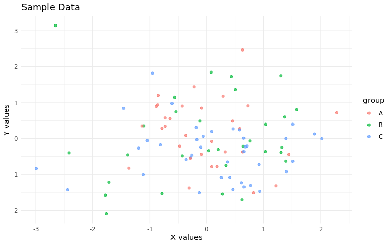

# Blog Post Features & Template

2025-01-15

<span class="dropcap dropcap--ornate dropcap--serious" data-first-letter="I" aria-hidden="true">I</span> keep finding myself looking up the same Quarto features every time I write a post, so I figured it would be useful to have a working example of everything in one place. Nothing groundbreaking here—just the basics that I use regularly and some things that took me a while to figure out.

## YAML Front Matter

The essential stuff goes at the top:

```yaml
title: 'Your Title'
description: 'Brief description for SEO'
date: 2025-01-15
categories: [Statistics, R]
tags: ['brms', 'Bayesian', 'simulation']
```

Other useful options:

- `lastUpdated`: When you made changes
- `heroImage`: Path to header image
- `draft: true`: Hide from site
- `cache: true`: Speed up builds for computational posts

## Typography & Math

Drop caps work with this syntax:

```html
<span class="dropcap" data-first-letter="I">I</span> started with...
```

Inline math like $\mu = \sum_{i=1}^n x_i$ and display equations:

$$
\hat{\beta} = (X^TX)^{-1}X^Ty
$$

Citations work like this ([Cinelli, Forney, and Pearl 2020](#ref-cinelliCrashCourseGood2020)) if you have a `references.bib` file.

> margin: This is a margin note that appears in the right margin. Useful for side comments or additional context.

Basic R chunk that shows code and runs it:

```r
library(ggplot2)
library(dplyr)

set.seed(42)
data <- data.frame(
  x = rnorm(100),
  y = rnorm(100) + 0.3 * rnorm(100),
  group = sample(c("A", "B", "C"), 100, replace = TRUE)
)

head(data, 3)
```

               x          y group
    1  1.3709584  0.6006866     B
    2 -0.5646982  1.1448842     B
    3  0.3631284 -0.6518111     C

<details class="code-collapse">

<summary>

Making plots with figure options

</summary>

```r
ggplot(data, aes(x = x, y = y, color = group)) +
  geom_point(alpha = 0.7) +
  theme_minimal() +
  labs(title = "Sample Data", x = "X values", y = "Y values")
```

</details>



> margin: Code chunk options go after `#|`. The most useful ones are `echo`, `eval`, `fig-cap`, and `fig-width`.

## Useful Chunk Options

Show code but don’t run it:

```r
expensive_function <- function(x) {
  # This displays but doesn't execute
  Sys.sleep(10)
  return(x^2)
}
```

Run code but hide it:

    [1] "Code runs, output shows, but code is hidden"

## Collapsible Code Sections

For longer code that might clutter the main text:

<details class="code-collapse">

<summary>

Show data processing code

</summary>

```r
# Simulate some messier data processing
processed_data <- data %>%
  filter(!is.na(x), !is.na(y)) %>%
  mutate(
    x_scaled = scale(x)[,1],
    y_scaled = scale(y)[,1],
    distance = sqrt(x_scaled^2 + y_scaled^2)
  ) %>%
  arrange(desc(distance))

head(processed_data, 3)
```

</details>

              x          y group  x_scaled   y_scaled distance
    1 -2.656455  3.1449272     B -2.582179  3.3197211 4.205734
    2 -2.993090 -0.8387712     C -2.905445 -0.7676472 3.005144
    3 -2.440467 -1.4272253     C -2.374769 -1.3714150 2.742317

## Common Patterns

**Show clean code, run complex version behind the scenes:**

<details class="code-collapse">

<summary>

Show simple model code

</summary>

```r
# What readers see
model <- lm(mpg ~ wt + hp, data = mtcars)
summary(model)
```

</details>

| term        | estimate | p.value |
| :---------- | -------: | ------: |
| (Intercept) |   37.227 |   0.000 |
| wt          |   -3.878 |   0.000 |
| hp          |   -0.032 |   0.001 |

**Quick reference for chunk options:**

| Option         | Purpose                |
| -------------- | ---------------------- |
| `echo: false`  | Hide code, show output |
| `eval: false`  | Show code, don’t run   |
| `fig-width: 8` | Control figure size    |
| `cache: true`  | Save results           |

## Other Stuff

Regular markdown works fine—**bold**, _italic_, `code`, [links](https://quarto.org/), lists, etc.

For more detailed options, check the [Quarto docs](https://quarto.org/docs/reference/).

## References

<div id="refs" class="references csl-bib-body hanging-indent" entry-spacing="0">

<div id="ref-cinelliCrashCourseGood2020" class="csl-entry">

Cinelli, Carlos, Andrew Forney, and Judea Pearl. 2020. “A Crash Course in Good and Bad Controls.” _SSRN Electronic Journal_. <https://doi.org/10.2139/ssrn.3689437>.

</div>

</div>
