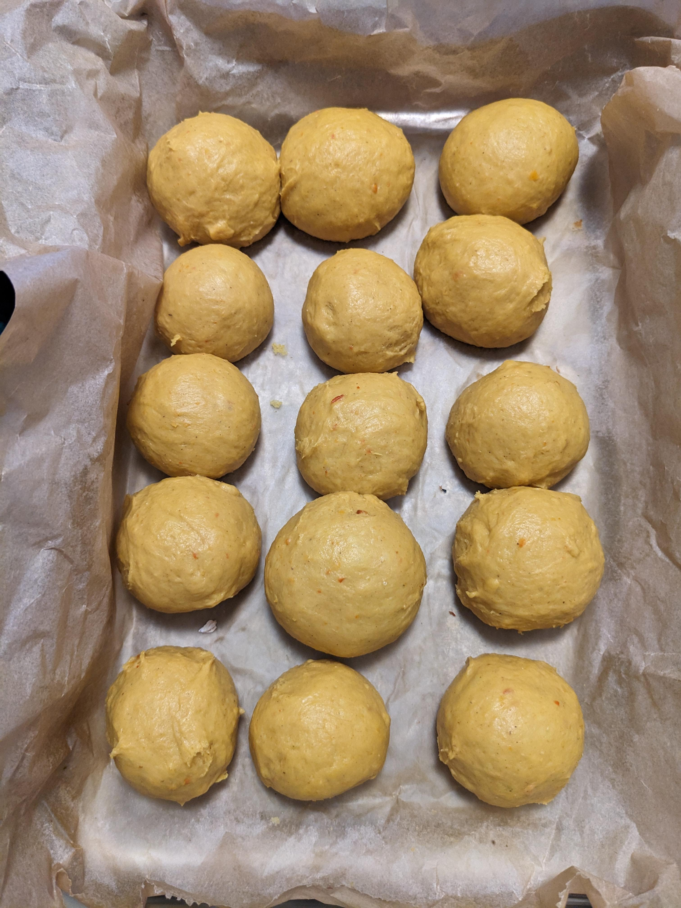
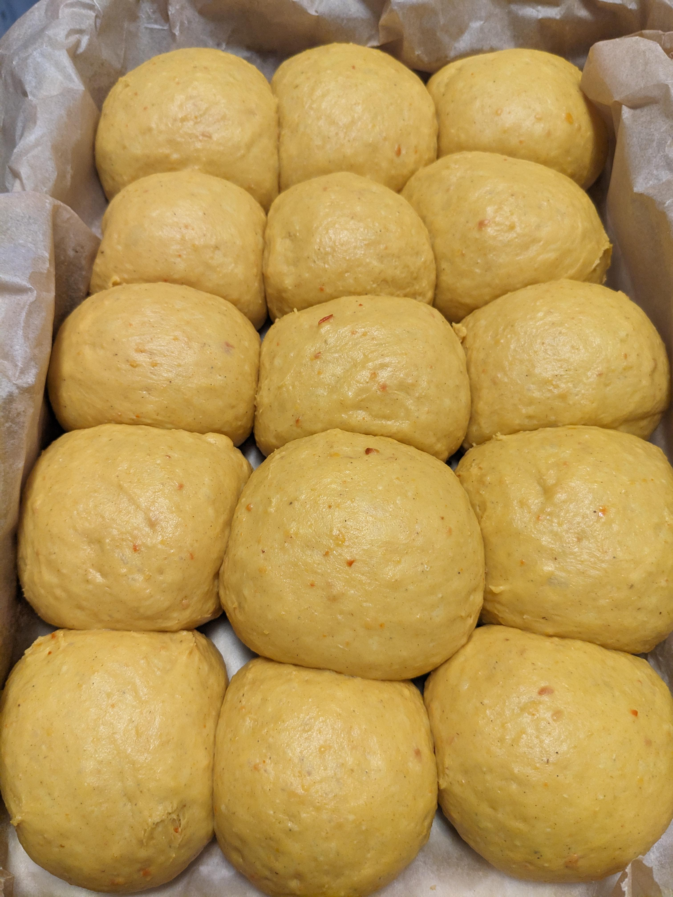
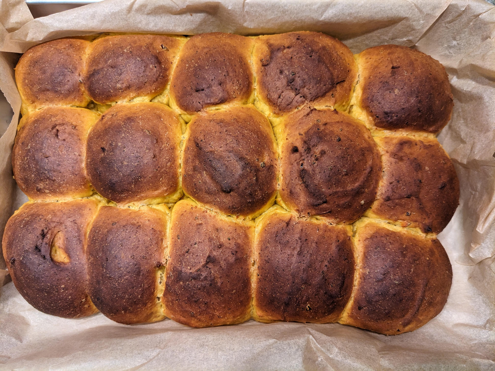

These dinner rolls have become a staple of the baking-grandma in our Brindlewood Bay group and are perfect for any occasion where you want some easy-to-portion bread on the side. The squash gives them a lovely color and keeps them soft. The Spices add a touch of autumn to them on top.

> margin: You can swap the butter for a plant-based alternative to make these vegan.

For the dough you'll need **350g Hokkaido squash**, **120ml water**, **400g flour**, **75g brown sugar**, **60g soft butter**, **7g instant yeast (1 bag)**, **1 tsp cinnamon**, **1 tsp cardamom**, **a pinch of nutmeg**, and a **pinch of salt**.

---

## The Squash

> margin: You can't really over-roast the squash here, as you can just blend it with more water later. Just make sure it's soft enough to mash easily. I want to eventually try roasting it at a higher temperature for a shorter time to get some caramelization on top.

Cut the squash into small cubes, the skin can stay on. Spread on a baking sheet and roast at 160 °C (320 °F) for about 25 minutes or until soft.

Let it cool a little and then blend it with the water until smooth. Put aside and let it cool further while you prepare the rest. You want the squash to be around room temperature before mixing it into the dough.

Depending on how comfy you are with sticky doughs, you can play with the water a little. I tend to use around 180ml as more water tends to make fluffier rolls. But shaping becomes harder. I'd suggest around 120ml as a starting point and then add more if you feel like it.
I've also experimented with weighing the squash after roasting and adding water until I reach around 420g total of squash + water, which also seems to work well.

---

## The Dough

> margin: Freshly grated lime, lemon or orange zest works wonderfully as well, especially combined with the cardamom.

Combine the squash purée with flour, sugar, soft butter, yeast, and spices. Don't forget the salt!
Knead the dough well until smooth, then cover and let rise for one hour.

For our group of murder mystery grandmas, below 50g sugar didn't give us the sweet-ish snack taste and above 100g started to enter full desert territory. 75g hit the balance of slightly sweet but still rolls rather than cake. The molasses notes from raw cane sugar pair nicely with the squash.

---

## Shaping and Baking

> margin: With higher hydration the dough gets clingy. Instead of fighting it with your hands you can use a bench scraper.

After the 1h rise, divide the dough into any number of equal pieces for the baking dish of your choice. I use a 34cm x 24cm ikea form that neatly fits 15 rolls in a 3x5 pattern. Line the dish with parchment paper and shape the pieces into balls.
Place the balls in the dish with a little space between them, cover and let rise for another hour. I use the larger 40cm x 32cm ikea form for that as it perfectly fits and has enough headroom.

> margin: The initial high heat helps the oven spring and prevents the rolls from turning out mushy.

Preheat the oven to **220 °C (425 °F)** conventional (200 °C / 400 °F convection). Put the softies in the oven, and after 8 minutes reduce the temperature to **200 °C (400 °F)** conventional (180 °C / 350 °F convection). Bake for around 23 minutes total or until golden brown on top.

Let them cool in the form and enjoy with friends. Works well with cottage cheese and jam or just butter, as many things tend to.
I find that the rolls store well in the (cooled) oven over night and make for a great weekend breakfast treat.
